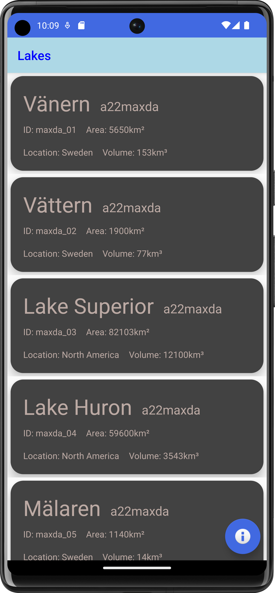
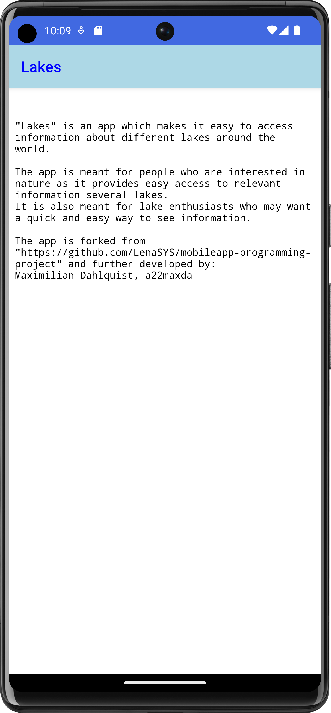

# Rapport

**Skriv din rapport här!**

_Du kan ta bort all text som finns sedan tidigare_.

## Följande grundsyn gäller dugga-svar:

- Ett kortfattat svar är att föredra. Svar som är längre än en sida text (skärmdumpar och programkod exkluderat) är onödigt långt.
- Svaret skall ha minst en snutt programkod.
- Svaret skall inkludera en kort övergripande förklarande text som redogör för vad respektive snutt programkod gör eller som svarar på annan teorifråga.
- Svaret skall ha minst en skärmdump. Skärmdumpar skall illustrera exekvering av relevant programkod. Eventuell text i skärmdumpar måste vara läsbar.
- I de fall detta efterfrågas, dela upp delar av ditt svar i för- och nackdelar. Dina för- respektive nackdelar skall vara i form av punktlistor med kortare stycken (3-4 meningar).

Programkod ska se ut som exemplet nedan. Koden måste vara korrekt indenterad då den blir lättare att läsa vilket gör det lättare att hitta syntaktiska fel.

Denna uppgift löstes genom att först skapa aktiviterna för recycleriewitem och about skärmen,
samt att lägga till stöd för JSON genom GSON biblioteket.
JSON_URL ger inget resultat så en JSON_FILE används istället, detta är ej optimalt då det inte går att
lägga till ny data direkt från nätet om en fil används.

```
    private final String JSON_URL = "https://mobprog.webug.se/json-api?login=a22maxda";
    private final String JSON_FILE = "json-api.json";
```

JsonItem klassen innehåller information från JSON filen, med variabler, en konstruktor och toString funktioner

```
private String name;
public JsonItems(name){
    this.name = name
}
public String toStringName(){
    return name;
}
```

Sedan skapades en textfil som används i about skärmen för att skriva ut text, samt att ändringar gjordes i  filerna för main och about aktiviteterna.
En kortvy skapades som separerar de olika JSON objekten från varandra, dessa kort kan även skriva ut flera attributer genom att använda sig av ett flertal TextViews.

Efter detta har mest buggfixning gjorts, ett problem uppstod där recyclerview gick utanför skärmen, detta löstes genom att ändra recyclerview höjden
från wrap_content till 0dp i activity_main.xml.

Variabelnamn i JsonItems har även ändrats för att bättre reflektera vad det är för variabler.
JSON filen har även bytts ut från en placeholder fil som användes för testning till den riktiga filen som innehåller rätt värden.

```
function errorCallback(error) {
    switch(error.code) {
        case error.PERMISSION_DENIED:
            // Geolocation API stöds inte, gör något
            break;
        case error.POSITION_UNAVAILABLE:
            // Misslyckat positionsanrop, gör något
            break;
        case error.UNKNOWN_ERROR:
            // Okänt fel, gör något
            break;
    }
}
```

Bilder läggs i samma mapp som markdown-filen.




Läs gärna:

- Boulos, M.N.K., Warren, J., Gong, J. & Yue, P. (2010) Web GIS in practice VIII: HTML5 and the canvas element for interactive online mapping. International journal of health geographics 9, 14. Shin, Y. &
- Wunsche, B.C. (2013) A smartphone-based golf simulation exercise game for supporting arthritis patients. 2013 28th International Conference of Image and Vision Computing New Zealand (IVCNZ), IEEE, pp. 459–464.
- Wohlin, C., Runeson, P., Höst, M., Ohlsson, M.C., Regnell, B., Wesslén, A. (2012) Experimentation in Software Engineering, Berlin, Heidelberg: Springer Berlin Heidelberg.
